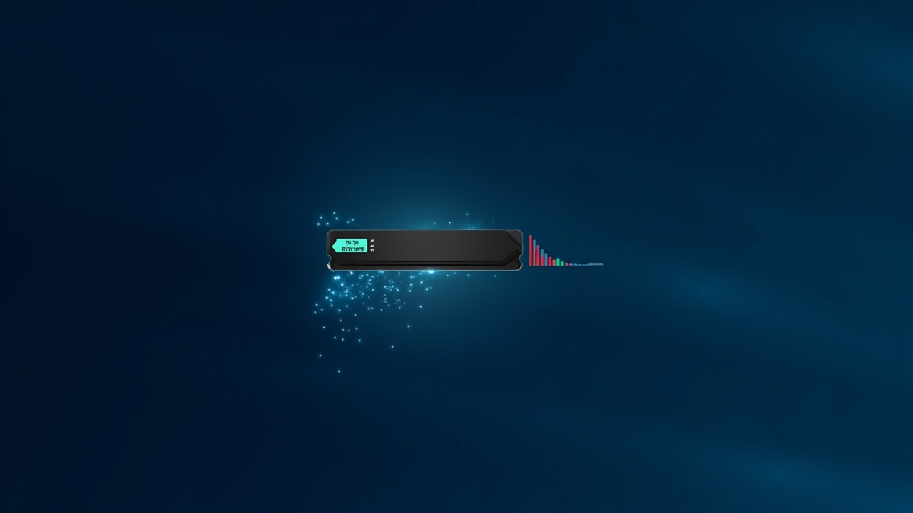

<p align="center">
  
</p>

<h1 align="center">🧹 MemoryCleaner — 智能内存清理工具</h1>

<p align="center">
  
  
  
  
</p>

<p align="center"><b>三重清理策略 · 定时自动清理 · 静默后台运行</b></p>

---

## ✨ 功能特性

| 功能 | 说明 |
|------|------|
| 🧹 三重清理 | 空工作集 · 系统缓存 · 进程优化 |
| ⏰ 定时清理 | 可设间隔自动执行 |
| 🛡️ 安全优先 | 只清理后台空闲内存 |
| 📊 托盘驻留 | 系统托盘运行，不占任务栏 |

## 🚀 快速开始

```bash
git clone https://github.com/xiaoweihua1/MemoryCleaner.git
pip install psutil
python main.py
```

## 📝 License
MIT © [xiaoweihua1](https://github.com/xiaoweihua1)